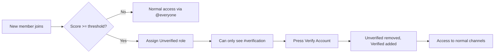

# AntiRaidVerify

Production-ready [Red Discord Bot](https://github.com/Cog-Creators/Red-DiscordBot) V3 cog that detects suspicious new members, quarantines them with an **Unverified** role, and requires button verification before granting server access.

## Features

- **Join suspicion scoring** — avatar, display name, account age, digit-heavy usernames, regex spam patterns
- **Configurable threshold** (default: 5)
- **Role-based quarantine** with verification channel + persistent **Verify Account** button
- **Timeout enforcement** — kick (default) or ban after configurable hours (default: 8)
- **Anti-abuse** — self-verify only, duplicate message prevention, restart-safe state, rate limits
- **Admin commands** — full guild configuration via `[p]arv` / slash commands
- **Audit logging** — embeds for joins, verifications, timeouts, and errors

## Requirements

- Red Discord Bot **3.5.0+**
- Python **3.8+**
- **Server Members Intent** enabled in the [Discord Developer Portal](https://discord.com/developers/applications)

No additional pip packages are required beyond Red.

## Installation

1. Install Red (if not already):

   ```bash
   python3 -m pip install -U Red-DiscordBot
   redbot-setup
   ```

2. Clone or copy this repository. The cog lives in the `antiraidverify/` folder.

3. Add the **parent directory** of `antiraidverify/` to Red's cog path:

   ```
   [p]addpath /absolute/path/to/pattern-ban
   [p]load antiraidverify
   ```

4. Sync slash commands:

   ```
   [p]slash sync
   ```

5. Configure the cog (see below) and run:

   ```
   [p]arv checksetup
   ```

## Quick Setup

Run these commands in your server (requires **Manage Server**):

```
[p]arv setchannel #verification
[p]arv setunverifiedrole @Unverified
[p]arv setverifiedrole @Verified
[p]arv logchannel #mod-logs
[p]arv checksetup
```

Optional tuning:

```
[p]arv threshold 5
[p]arv accountage 7
[p]arv agebypass 30
[p]arv timeout 8
[p]arv timeoutaction kick
[p]arv whitelist add @Trusted
```

View all settings:

```
[p]arv config
```

## Scoring System

When a member joins, the cog computes a suspicion score:

| Factor | Points |
|--------|--------|
| No custom avatar | +2 |
| Default Discord avatar | +1 |
| Display name equals username | +2 |
| Account younger than configured days | +4 |
| Username contains many digits | +2 |
| Spam-like username (regex) | +2 |

If **score ≥ threshold** (default 5), the member is quarantined.

Members with a **whitelist role** or accounts older than **age bypass** days skip quarantine entirely.

During **mass join** events (configurable window), the effective threshold increases by 1 to reduce false positives while still logging the raid.

## Permission Setup

### Bot role

Place the bot role **above** both **Verified** and **Unverified** roles.

Required permissions:

- Manage Roles
- Kick Members (and **Ban Members** if using timeout bans)
- Manage Messages
- View Channels
- Send Messages
- Embed Links

### Role hierarchy (top → bottom)

```
Bot → Verified → Unverified → @everyone
```

### Channel overwrites

Configure these manually in Discord — the cog validates but does not auto-modify channel permissions.

| Channel | @everyone | Unverified | Verified |
|---------|-----------|------------|----------|
| `#verification` | Deny View Channel | Allow View + Send Messages | Allow View (optional) |
| `#general` and others | Allow View Channel | **Deny View Channel** | Allow View Channel |

**Important:** `@everyone` should **not** see `#verification` directly. Only **Unverified** (and staff) should access it until the member verifies and receives the **Verified** role.

### Example permission flow



## Admin Commands

| Command | Description |
|---------|-------------|
| `[p]arv setchannel #channel` | Verification channel |
| `[p]arv setverifiedrole @role` | Role after verification |
| `[p]arv setunverifiedrole @role` | Quarantine role |
| `[p]arv threshold <int>` | Suspicion score threshold |
| `[p]arv accountage <days>` | Account age scoring window |
| `[p]arv agebypass <days>` | Skip quarantine for older accounts (0=off) |
| `[p]arv timeout <hours>` | Verification deadline |
| `[p]arv timeoutaction kick\|ban` | Action on timeout |
| `[p]arv banduration <hours>` | Temp ban length (0=permanent) |
| `[p]arv whitelist add\|remove @role` | Bypass roles |
| `[p]arv logchannel #channel` | Audit log channel |
| `[p]arv enable` / `[p]arv disable` | Toggle module |
| `[p]arv config` | View configuration |
| `[p]arv verify @member` | Manual verify |
| `[p]arv quarantine @member` | Manual quarantine |
| `[p]arv checksetup` | Validate configuration |

## Verification Flow

1. Suspicious member joins → **Unverified** role assigned.
2. Embed + **Verify Account** button posted in `#verification`.
3. Only the quarantined user can press the button (others get an ephemeral error).
4. On success: roles updated, message deleted/edited, state cleared, event logged.
5. On timeout: member kicked/banned, message cleaned up, event logged.

### Restart safety

Pending verifications are stored in Red's Config system. On cog load:

- The persistent button view is re-registered with `bot.add_view()`
- Stale messages (deleted manually) are cleaned from storage
- The timeout background task resumes

## Architecture

```
antiraidverify/
├── antiraidverify.py    # Cog lifecycle, join listener
├── storage.py           # Red Config + pending state
├── scoring.py           # Suspicion scoring (pure functions)
├── quarantine.py        # Role management
├── verification.py      # Embeds, persistent View, verify handler
├── timeout.py           # Background timeout enforcement
├── massjoin.py          # Join rate tracking
├── logging.py           # Audit embeds
├── constants.py         # Defaults
├── models.py            # Typed dataclasses
└── commands/admin.py    # Hybrid admin commands
```

## Troubleshooting

| Issue | Fix |
|-------|-----|
| Cog doesn't react to joins | Enable **Server Members Intent**; run `[p]arv enable` |
| Button does nothing after restart | Reload cog; ensure message still exists in verification channel |
| Cannot assign roles | Run `[p]arv checksetup`; move bot role above Unverified/Verified |
| Slash commands missing | Run `[p]slash sync` |
| Members see all channels while unverified | Fix channel permission overwrites for Unverified role |
| Timeouts not working | Ensure bot has Kick/Ban permission; reload cog after update; timeout checks run every 60s (wait up to 1 extra minute); changing `[p]arv timeout` only affects **new** quarantines |

## License

Provided as-is for use with Red Discord Bot. Adapt and extend as needed for your community.
